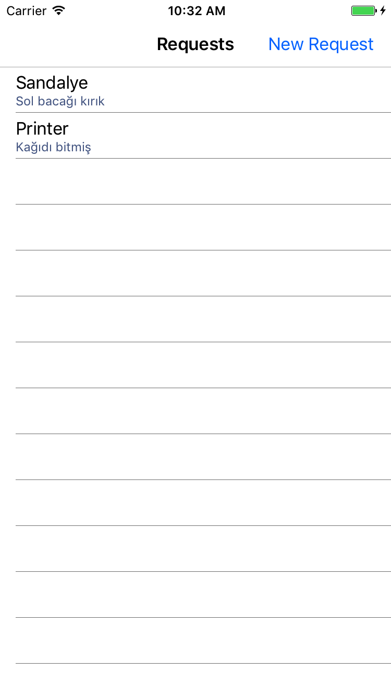
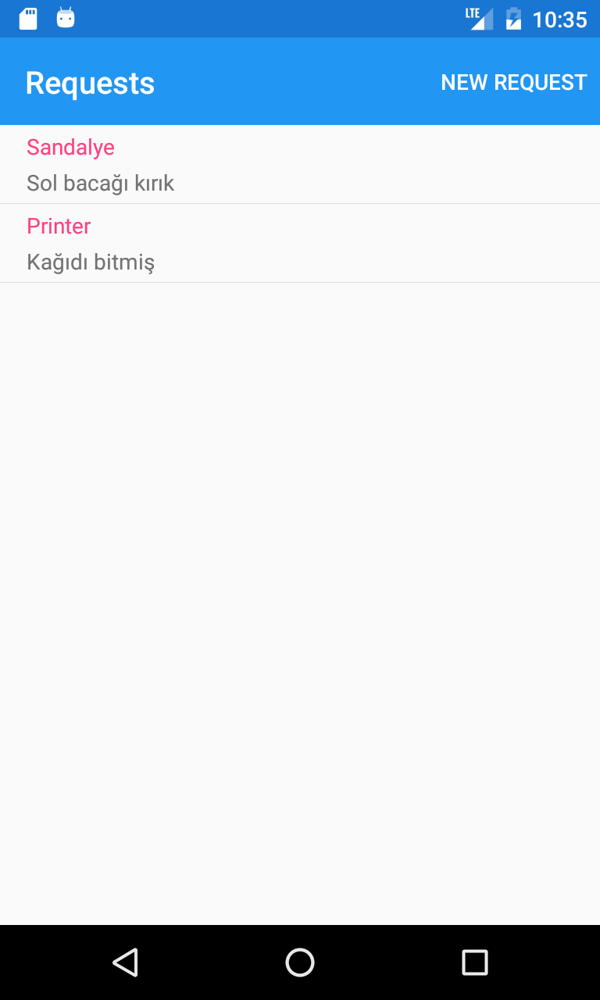
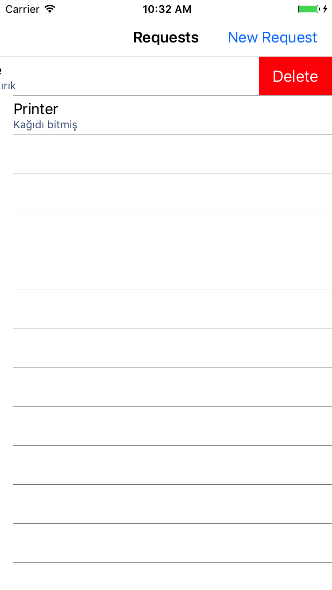
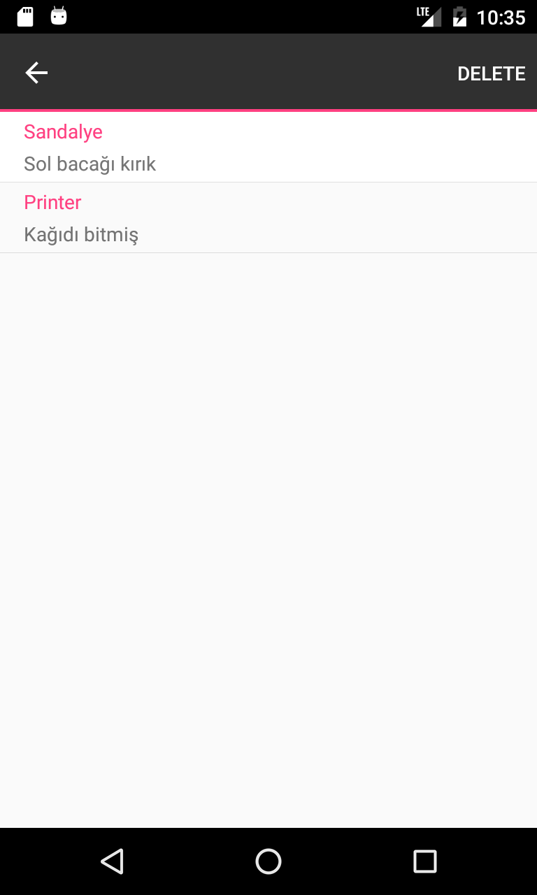
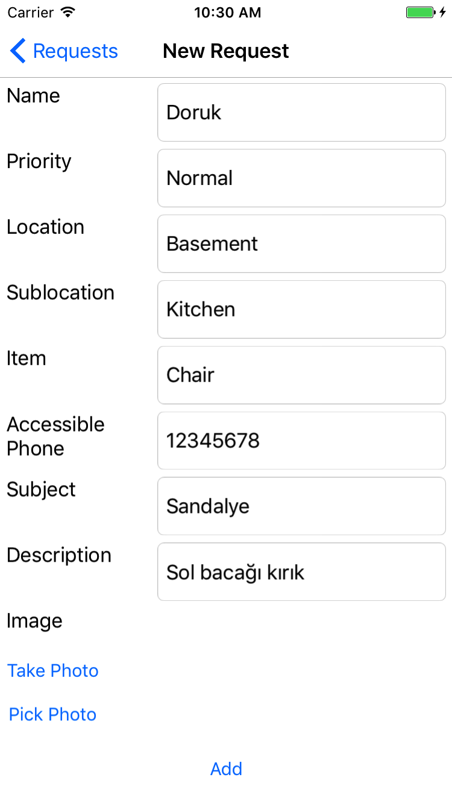

# Microsoft Desk

Bu uygulamamızda Azure Blob Service ve Azure App Service nasıl kullanılır onu öğreneceğiz.

Azure Mobile Appsin senkronizasyon özelliği sayesinde internete erişimizin olmadığı zamanlarda bile uygulamamız kullanibilir olacak ve değişiklikler local databasede tutulacak. İnternete erişebildiğiniz zaman da otomatik olarak bilgileriniz senkronize olacak.

Uygulamamız şirket içi bir sorun ile karşılaştığınızda new request açabildiğiniz, dilerseniz fotoğrafını seçebildiğiniz ve açılmış requestlere bakabildiğiniz bir uygulama.

Öncelikle uygulamamız bittiğinde nasıl görünecek ona bakalım.

## Blob Manager.cs

Azure üstünden Blob storage açtıktan sonra iki şeyini not alıyoruz. Birincisi ismi, ikincisi access keys in altındaki connection string.

    //Buraya not aldığınız connection stringinizi girin
    static string connectionString = "";
    
    //Connection stringinizle bir CloudBlobClient oluştuşturuyoruz
    CloudBlobClient _blobClient = CloudStorageAccount
            .Parse(connectionString)
            .CreateCloudBlobClient();

    //Ardından containerımızı oluşturuyoruz.
    //Parantez içine not aldığınız ismi girin
    BlobManager()
        {
            _fullResContainer = _blobClient.GetContainerReference("helpdeskblob");

        }

Aşağıdaki method ile upload işleminizi gerçekleştirebilirsiniz. Bu methodda blobumuzun url sini döndürüyoruz.

    CloudBlobContainer _fullResContainer;
    public async Task<Uri> UploadFileAsync(string localPath)
        {
            var uniqueBlobName = Guid.NewGuid().ToString();
            uniqueBlobName += Path.GetExtension(localPath);
            var blobRef = _fullResContainer.GetBlockBlobReference(uniqueBlobName);

            await blobRef.UploadFromFileAsync(localPath).ConfigureAwait(false);

            return blobRef.Uri;
        }

Aşağıdaki method ile yüklenmiş bütün fotoğraflara erişebilirsiniz.

    public async Task<List<Uri>> GetAllBlobUrisAsync()
        {
            var contToken = new BlobContinuationToken();
            var allBlobs = await _fullResContainer.ListBlobsSegmentedAsync(contToken).ConfigureAwait(false);
            var uris = allBlobs.Results.Select(b => b.Uri).ToList();
            return uris;
        }

    
## Azure App Services

Azure App Services'in offline sync hizmeti sayesinde internete bağlı olmadığımız zamanlarda bile kullanıcılar mobile applicationımızı kullanabilecekler ve request ekleyip çıkarabilecekler. Bu değişikler bir local databasede tutulacak ve cihaz internete bağlandığında değişiklikler senkronize edilecek. 

## iOS

AppDelegate kısmına aşağıdaki iki satırı kopyalıyoruz.

    Microsoft.WindowsAzure.MobileServices.CurrentPlatform.Init();
    SQLitePCL.Batteries.Init();

## Android

MainActivity kısmına aşağıdaki iki satırı kopyalıyoruz.

    MobileServiceClient client { get; set; }
    IMobileServiceSyncTable<Request> table;

## Initialization

Herhangi bir senkronizasyon yapmadan önce local storageımızı oluşturuyoruz. Buradaki url imiz Azure App Service kurarken belirttiğimiz url.

    public async Task Initialize()
    {
        if (client?.SyncContext?.IsInitialized ?? false) return;

        var azureUrl = "https://microsofthelpdesk.azurewebsites.net";

        //Create our client
        client = new MobileServiceClient(azureUrl);

        //InitializeDatabase for path
        var path = "requestDatabase.db";
        path = Path.Combine(MobileServiceClient.DefaultDatabasePath, path);

        //setup our local sqlite store and initialize our table
        var store = new MobileServiceSQLiteStore(path);

        //Define table
        store.DefineTable<Request>();

        //Initialize SyncContext
        await client.SyncContext.InitializeAsync(store, new MobileServiceSyncHandler());

        table = client.GetSyncTable<Request>();

        var current = table.ToListAsync();
    }

## Senkronizasyon

SyncAsync methodu sayesinde local databaseimiz Azure Mobile Apps ile senkronize bir şekilde çalışabiliyor.

    public async Task SyncRequests()
    {
        try
        {
            await client.SyncContext.PushAsync();
            await table.PullAsync("requests", table.CreateQuery());
        }
        catch (Exception ex)
        {
            Debug.WriteLine("Unable to sync, using offline capabilities " + ex);
        }
    } 

## Operasyonlar

Request listesini almak için:
    
    public async Task<List<Request>> GetRequests()
    {
        await Initialize();
        await SyncRequests();
        return await table.ToListAsync();
    }

Request eklemek için:

    public async Task InsertRequest(Request request)
    {
        await Initialize();
        await table.InsertAsync(request);
        await SyncRequests();
    }

Request silmek için:

    public async Task DeleteTaskAsync(Request request)
    {
        await Initialize();
        await table.DeleteAsync(request);
        await SyncRequests();
    }

### Yukarıdaki yarattığımız komutları viewlar içerisinde nasıl kullanığımıza bir bakalım.

## IssuePage

Kullanıcı Add butonuna bastığında onAddClick devreye giriyor ve gerekli doğrulamalardan sonra kullanıcının seçtiği fotoğrafı BlobManageri kullanarak upload ediyor.

    var url = await BlobManager.Instance.UploadFileAsync(path);

Daha sonra da oluşturulan requesti Azure Service'in insertRequest komutuyla ekliyor.

    await azureService.InsertRequest(
        new Request
        {
            Name = nameEntry.Text,
            Priority = priorityEntry.Text,
            Location = locationPicker.SelectedItem.ToString(),
            Sublocation = sublocationPicker.SelectedItem.ToString(),
            Item = itemEntry.Text,
            Photo = url.ToString(),
            AccessiblePhone = phoneEntry.Text,
            Subject = subjectEntry.Text,
            Description = descriptionEntry.Text,
        });

## RequestPage

BindingContext'e azureService'in GetRequests komutunu veriyoruz.

    listView.BindingContext = azureService.GetRequests();

Herhangi bir requesti de aşağıdaki gibi bir komutla silebilirsiniz.

    var selectedMenuItem = (MenuItem)sender;
    var selectedItem = (Request)selectedMenuItem.BindingContext;
    var azureService = new AzureService();
    await azureService.DeleteTaskAsync(selectedItem);